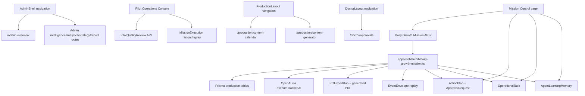

# VIP Dependency Graph

Generated: 2026-06-05. Source-reference graph only; no deletions.

## Production Core Graph

## Navigation References

| Navigator | Location | Linked Scope | Release finding |
| --- | --- | --- | --- |
| AdminShell | apps/web/src/components/admin/admin-shell.tsx:41 | Admin overview, intelligence, strategy, analytics, reports, hospitals, users, permissions, audit, AI/system health | Production-focused but Mission Control/Pilot Operations are not first-level admin nav. |
| ProductionLayout | apps/web/src/app/production/layout.tsx:25 | Command Centre, content calendar, generator, script studio, content pipeline, recommendations, strategy, campaigns, special days, social/hashtag intelligence | Contains placeholder-linked routes that should be hidden or completed before production. |
| DoctorLayout | apps/web/src/app/doctor/layout.tsx:10 | Doctor briefing, approvals, reputation, reports, summary | Aligned with target Doctor workspace, though some pages remain demo-fed. |
| roleNavigation | apps/web/src/navigation/role-navigation.ts:20 | Admin, production, staff, doctor role hubs | Contains broad optional links and should be trimmed to max 3 levels. |
| Mission Control surface map | apps/web/src/app/admin/workspaces/[id]/mission-control/page.tsx:47 | Dashboard, Alerts, Copilot, Tasks, Insights, Command Center, War Room, Daily Growth | Labels AI Copilot and War Room as mock; add Pilot Operations link for pilot release. |

## Page Dependency Matrix

| Route | Location | Linked From Navigation | Linked From Mission Control | Referenced By API/Workflow/Agent/Test | Release Note |
| --- | --- | --- | --- | --- | --- |
| /admin/ai-audit | apps/web/src/app/admin/ai-audit/page.tsx | Yes | No | No direct subsystem reference found | Contains demo/mock/preview markers |
| /admin/ai | apps/web/src/app/admin/ai/page.tsx | Yes | No | No direct subsystem reference found | Route exists in App Router |
| /admin/analytics/engagement | apps/web/src/app/admin/analytics/engagement/page.tsx | Yes | No | No direct subsystem reference found | Route exists in App Router |
| /admin/analytics/facebook | apps/web/src/app/admin/analytics/facebook/page.tsx | Yes | No | No direct subsystem reference found | Route exists in App Router |
| /admin/analytics/instagram | apps/web/src/app/admin/analytics/instagram/page.tsx | Yes | No | No direct subsystem reference found | Contains demo/mock/preview markers |
| /admin/analytics | apps/web/src/app/admin/analytics/page.tsx | Yes | No | No direct subsystem reference found | Route exists in App Router |
| /admin/analytics/reviews | apps/web/src/app/admin/analytics/reviews/page.tsx | Yes | No | No direct subsystem reference found | Route exists in App Router |
| /admin/approvals | apps/web/src/app/admin/approvals/page.tsx | Yes | No | Yes/production subsystem reference | Route exists in App Router |
| /admin/audit-logs | apps/web/src/app/admin/audit-logs/page.tsx | Yes | No | No direct subsystem reference found | Contains demo/mock/preview markers |
| /admin/automation | apps/web/src/app/admin/automation/page.tsx | Yes | No | Yes/production subsystem reference | Route exists in App Router |
| /admin/brand-voice | apps/web/src/app/admin/brand-voice/page.tsx | Yes | No | No direct subsystem reference found | Route exists in App Router |
| /admin/command-centre | apps/web/src/app/admin/command-centre/page.tsx | Yes | No | No direct subsystem reference found | Route exists in App Router |
| /admin/executive-growth-report | apps/web/src/app/admin/executive-growth-report/page.tsx | Yes | No | Yes/production subsystem reference | Route exists in App Router |
| /admin/hospitals | apps/web/src/app/admin/hospitals/page.tsx | Yes | No | No direct subsystem reference found | Contains demo/mock/preview markers |
| /admin/integrations/health | apps/web/src/app/admin/integrations/health/page.tsx | Yes | No | No direct subsystem reference found | Route exists in App Router |
| /admin/integrations | apps/web/src/app/admin/integrations/page.tsx | Yes | No | No direct subsystem reference found | Route exists in App Router |
| /admin/intelligence/forecasting | apps/web/src/app/admin/intelligence/forecasting/page.tsx | Yes | No | No direct subsystem reference found | Route exists in App Router |
| /admin/intelligence/gbp | apps/web/src/app/admin/intelligence/gbp/page.tsx | Yes | No | No direct subsystem reference found | Route exists in App Router |
| /admin/intelligence/seo | apps/web/src/app/admin/intelligence/seo/page.tsx | Yes | No | No direct subsystem reference found | Route exists in App Router |
| /admin/intelligence/social | apps/web/src/app/admin/intelligence/social/page.tsx | Yes | No | No direct subsystem reference found | Route exists in App Router |
| /admin/intelligence/trend | apps/web/src/app/admin/intelligence/trend/page.tsx | Yes | No | No direct subsystem reference found | Route exists in App Router |
| /admin layout | apps/web/src/app/admin/layout.tsx | Yes | No | No direct subsystem reference found | Route exists in App Router |
| /admin | apps/web/src/app/admin/page.tsx | Yes | No | No direct subsystem reference found | Route exists in App Router |
| /admin/permissions | apps/web/src/app/admin/permissions/page.tsx | Yes | No | Yes/production subsystem reference | Contains demo/mock/preview markers |
| /admin/reports | apps/web/src/app/admin/reports/page.tsx | Yes | No | Yes/production subsystem reference | Route exists in App Router |
| /admin/reports/weekly-analysis | apps/web/src/app/admin/reports/weekly-analysis/page.tsx | Yes | No | Yes/production subsystem reference | Route exists in App Router |
| /admin/requests | apps/web/src/app/admin/requests/page.tsx | Yes | No | No direct subsystem reference found | Route exists in App Router |
| /admin/strategy/competitor-gap | apps/web/src/app/admin/strategy/competitor-gap/page.tsx | Yes | No | No direct subsystem reference found | Route exists in App Router |
| /admin/strategy/content | apps/web/src/app/admin/strategy/content/page.tsx | Yes | No | No direct subsystem reference found | Route exists in App Router |
| /admin/strategy/conversion-path | apps/web/src/app/admin/strategy/conversion-path/page.tsx | Yes | No | No direct subsystem reference found | Route exists in App Router |
| /admin/strategy/gbp | apps/web/src/app/admin/strategy/gbp/page.tsx | Yes | No | No direct subsystem reference found | Route exists in App Router |
| /admin/strategy | apps/web/src/app/admin/strategy/page.tsx | Yes | No | No direct subsystem reference found | Route exists in App Router |
| /admin/strategy/positioning | apps/web/src/app/admin/strategy/positioning/page.tsx | Yes | No | No direct subsystem reference found | Route exists in App Router |
| /admin/strategy/reviews | apps/web/src/app/admin/strategy/reviews/page.tsx | Yes | No | No direct subsystem reference found | Route exists in App Router |
| /admin/strategy/seo | apps/web/src/app/admin/strategy/seo/page.tsx | Yes | No | No direct subsystem reference found | Route exists in App Router |
| /admin/strategy/social | apps/web/src/app/admin/strategy/social/page.tsx | Yes | No | No direct subsystem reference found | Route exists in App Router |
| /admin/strategy/whatsapp | apps/web/src/app/admin/strategy/whatsapp/page.tsx | Yes | No | No direct subsystem reference found | Route exists in App Router |
| /admin/system/ai-health | apps/web/src/app/admin/system/ai-health/page.tsx | Yes | No | No direct subsystem reference found | Route exists in App Router |
| /admin/system/api-audit | apps/web/src/app/admin/system/api-audit/page.tsx | Yes | No | Yes/production subsystem reference | Route exists in App Router |
| /admin/system/platform-verification | apps/web/src/app/admin/system/platform-verification/page.tsx | Yes | No | No direct subsystem reference found | Route exists in App Router |
| /admin/teams | apps/web/src/app/admin/teams/page.tsx | Yes | No | No direct subsystem reference found | Route exists in App Router |
| /admin/templates | apps/web/src/app/admin/templates/page.tsx | Yes | No | No direct subsystem reference found | Route exists in App Router |
| /admin/users | apps/web/src/app/admin/users/page.tsx | Yes | No | No direct subsystem reference found | Contains demo/mock/preview markers |
| /admin/workflows | apps/web/src/app/admin/workflows/page.tsx | Yes | No | No direct subsystem reference found | Route exists in App Router |
| /admin/workspaces/[id]/alerts/[alertId] | apps/web/src/app/admin/workspaces/[id]/alerts/[alertId]/page.tsx | Yes | Yes/Possible | No direct subsystem reference found | Route exists in App Router |
| /admin/workspaces/[id]/alerts | apps/web/src/app/admin/workspaces/[id]/alerts/page.tsx | Yes | Yes/Possible | No direct subsystem reference found | Route exists in App Router |
| /admin/workspaces/[id]/command-center | apps/web/src/app/admin/workspaces/[id]/command-center/page.tsx | Yes | Yes/Possible | No direct subsystem reference found | Contains demo/mock/preview markers |
| /admin/workspaces/[id]/competitor-intelligence | apps/web/src/app/admin/workspaces/[id]/competitor-intelligence/page.tsx | Yes | Yes/Possible | No direct subsystem reference found | Route exists in App Router |
| /admin/workspaces/[id]/copilot | apps/web/src/app/admin/workspaces/[id]/copilot/page.tsx | Yes | Yes/Possible | No direct subsystem reference found | Route exists in App Router |
| /admin/workspaces/[id]/dashboard | apps/web/src/app/admin/workspaces/[id]/dashboard/page.tsx | Yes | Yes/Possible | No direct subsystem reference found | Contains demo/mock/preview markers |
| /admin/workspaces/[id]/executive | apps/web/src/app/admin/workspaces/[id]/executive/page.tsx | Yes | Yes/Possible | No direct subsystem reference found | Route exists in App Router |
| /admin/workspaces/[id]/insights | apps/web/src/app/admin/workspaces/[id]/insights/page.tsx | Yes | Yes/Possible | No direct subsystem reference found | Contains demo/mock/preview markers |
| /admin/workspaces/[id]/learning-engine | apps/web/src/app/admin/workspaces/[id]/learning-engine/page.tsx | Yes | Yes/Possible | No direct subsystem reference found | Route exists in App Router |
| /admin/workspaces/[id]/mission-control | apps/web/src/app/admin/workspaces/[id]/mission-control/page.tsx | Yes | Yes/Possible | Yes/production subsystem reference | Contains demo/mock/preview markers |
| /admin/workspaces/[id] | apps/web/src/app/admin/workspaces/[id]/page.tsx | Yes | Yes/Possible | No direct subsystem reference found | Route exists in App Router |
| /admin/workspaces/[id]/pilot-operations | apps/web/src/app/admin/workspaces/[id]/pilot-operations/page.tsx | Yes | Yes/Possible | No direct subsystem reference found | Route exists in App Router |
| /admin/workspaces/[id]/publishing | apps/web/src/app/admin/workspaces/[id]/publishing/page.tsx | Yes | Yes/Possible | No direct subsystem reference found | Route exists in App Router |
| /admin/workspaces/[id]/social-agent | apps/web/src/app/admin/workspaces/[id]/social-agent/page.tsx | Yes | Yes/Possible | Yes/production subsystem reference | Route exists in App Router |
| /admin/workspaces/[id]/tasks | apps/web/src/app/admin/workspaces/[id]/tasks/page.tsx | Yes | Yes/Possible | Yes/production subsystem reference | Route exists in App Router |
| /admin/workspaces/[id]/voice | apps/web/src/app/admin/workspaces/[id]/voice/page.tsx | Yes | Yes/Possible | No direct subsystem reference found | Route exists in App Router |
| /admin/workspaces/[id]/war-room | apps/web/src/app/admin/workspaces/[id]/war-room/page.tsx | Yes | Yes/Possible | No direct subsystem reference found | Route exists in App Router |
| /analytics | apps/web/src/app/analytics/page.tsx | No strong top-level nav reference found | No | No direct subsystem reference found | Route exists in App Router |
| /auth/accept-invite | apps/web/src/app/auth/accept-invite/page.tsx | No strong top-level nav reference found | No | No direct subsystem reference found | Route exists in App Router |
| /calendar | apps/web/src/app/calendar/page.tsx | No strong top-level nav reference found | No | No direct subsystem reference found | Route exists in App Router |
| /campaign-studio | apps/web/src/app/campaign-studio/page.tsx | No strong top-level nav reference found | No | No direct subsystem reference found | Route exists in App Router |
| /dashboard | apps/web/src/app/dashboard/page.tsx | No strong top-level nav reference found | No | No direct subsystem reference found | Route exists in App Router |
| /design-mockups | apps/web/src/app/design-mockups/page.tsx | No strong top-level nav reference found | No | No direct subsystem reference found | Route exists in App Router |
| /doctor/approvals | apps/web/src/app/doctor/approvals/page.tsx | Yes | No | Yes/production subsystem reference | Route exists in App Router |
| /doctor/executive-growth-report | apps/web/src/app/doctor/executive-growth-report/page.tsx | Yes | No | Yes/production subsystem reference | Route exists in App Router |
| /doctor layout | apps/web/src/app/doctor/layout.tsx | Yes | No | No direct subsystem reference found | Route exists in App Router |
| /doctor/morning-briefing | apps/web/src/app/doctor/morning-briefing/page.tsx | Yes | No | No direct subsystem reference found | Route exists in App Router |
| /doctor | apps/web/src/app/doctor/page.tsx | Yes | No | No direct subsystem reference found | Route exists in App Router |
| /doctor/reports | apps/web/src/app/doctor/reports/page.tsx | Yes | No | Yes/production subsystem reference | Route exists in App Router |
| /doctor/reputation | apps/web/src/app/doctor/reputation/page.tsx | Yes | No | No direct subsystem reference found | Route exists in App Router |
| /doctor/summary | apps/web/src/app/doctor/summary/page.tsx | Yes | No | No direct subsystem reference found | Route exists in App Router |
| /eight-weeks | apps/web/src/app/eight-weeks/page.tsx | No strong top-level nav reference found | No | No direct subsystem reference found | Route exists in App Router |
| /governance | apps/web/src/app/governance/page.tsx | No strong top-level nav reference found | No | No direct subsystem reference found | Route exists in App Router |
| /growth-plan | apps/web/src/app/growth-plan/page.tsx | No strong top-level nav reference found | No | No direct subsystem reference found | Route exists in App Router |
|  layout | apps/web/src/app/layout.tsx | No strong top-level nav reference found | No | No direct subsystem reference found | Route exists in App Router |
| /local-market | apps/web/src/app/local-market/page.tsx | No strong top-level nav reference found | No | No direct subsystem reference found | Route exists in App Router |
| /login | apps/web/src/app/login/page.tsx | No strong top-level nav reference found | No | No direct subsystem reference found | Route exists in App Router |
| /onboarding | apps/web/src/app/onboarding/page.tsx | No strong top-level nav reference found | No | No direct subsystem reference found | Route exists in App Router |
| /opportunities/[slug] | apps/web/src/app/opportunities/[slug]/page.tsx | No strong top-level nav reference found | No | No direct subsystem reference found | Route exists in App Router |
| /outreach | apps/web/src/app/outreach/page.tsx | No strong top-level nav reference found | No | No direct subsystem reference found | Route exists in App Router |
| /overview | apps/web/src/app/overview/page.tsx | No strong top-level nav reference found | No | No direct subsystem reference found | Route exists in App Router |
| / | apps/web/src/app/page.tsx | No strong top-level nav reference found | No | No direct subsystem reference found | Route exists in App Router |
| /production/analytics | apps/web/src/app/production/analytics/page.tsx | Yes | No | No direct subsystem reference found | Route exists in App Router |
| /production/calendar | apps/web/src/app/production/calendar/page.tsx | Yes | No | No direct subsystem reference found | Route exists in App Router |
| /production/campaigns | apps/web/src/app/production/campaigns/page.tsx | Yes | No | No direct subsystem reference found | Contains demo/mock/preview markers |
| /production/command-centre | apps/web/src/app/production/command-centre/page.tsx | Yes | No | No direct subsystem reference found | Route exists in App Router |
| /production/content-calendar | apps/web/src/app/production/content-calendar/page.tsx | Yes | No | No direct subsystem reference found | Route exists in App Router |
| /production/content-generator | apps/web/src/app/production/content-generator/page.tsx | Yes | No | No direct subsystem reference found | Route exists in App Router |
| /production/content-pipeline | apps/web/src/app/production/content-pipeline/page.tsx | Yes | No | No direct subsystem reference found | Contains demo/mock/preview markers |
| /production/content-strategy | apps/web/src/app/production/content-strategy/page.tsx | Yes | No | No direct subsystem reference found | Route exists in App Router |
| /production/content | apps/web/src/app/production/content/page.tsx | Yes | No | No direct subsystem reference found | Route exists in App Router |
| /production/hashtags | apps/web/src/app/production/hashtags/page.tsx | Yes | No | No direct subsystem reference found | Route exists in App Router |
| /production layout | apps/web/src/app/production/layout.tsx | Yes | No | No direct subsystem reference found | Contains demo/mock/preview markers |
| /production/library | apps/web/src/app/production/library/page.tsx | Yes | No | No direct subsystem reference found | Route exists in App Router |
| /production | apps/web/src/app/production/page.tsx | Yes | No | No direct subsystem reference found | Route exists in App Router |
| /production/placeholder-page.tsx | apps/web/src/app/production/placeholder-page.tsx | Yes | No | No direct subsystem reference found | Contains demo/mock/preview markers |
| /production/recommendations | apps/web/src/app/production/recommendations/page.tsx | Yes | No | No direct subsystem reference found | Route exists in App Router |
| /production/script-studio | apps/web/src/app/production/script-studio/page.tsx | Yes | No | No direct subsystem reference found | Route exists in App Router |
| /production/social-intelligence | apps/web/src/app/production/social-intelligence/page.tsx | Yes | No | No direct subsystem reference found | Route exists in App Router |
| /production/special-days | apps/web/src/app/production/special-days/page.tsx | Yes | No | No direct subsystem reference found | Contains demo/mock/preview markers |
| /production/workflows | apps/web/src/app/production/workflows/page.tsx | Yes | No | No direct subsystem reference found | Route exists in App Router |
| /request-setup | apps/web/src/app/request-setup/page.tsx | No strong top-level nav reference found | No | No direct subsystem reference found | Route exists in App Router |
| /results | apps/web/src/app/results/page.tsx | No strong top-level nav reference found | No | No direct subsystem reference found | Route exists in App Router |
| /roles/[role] | apps/web/src/app/roles/[role]/page.tsx | No strong top-level nav reference found | No | No direct subsystem reference found | Route exists in App Router |
| /roles/admin | apps/web/src/app/roles/admin/page.tsx | Yes | No | No direct subsystem reference found | Route exists in App Router |
| /staff/approvals | apps/web/src/app/staff/approvals/page.tsx | Yes | No | Yes/production subsystem reference | Route exists in App Router |
| /staff | apps/web/src/app/staff/page.tsx | Yes | No | No direct subsystem reference found | Route exists in App Router |
| /staff/requests | apps/web/src/app/staff/requests/page.tsx | Yes | No | No direct subsystem reference found | Route exists in App Router |
| /staff/tasks | apps/web/src/app/staff/tasks/page.tsx | Yes | No | Yes/production subsystem reference | Route exists in App Router |
| /staff/uploads | apps/web/src/app/staff/uploads/page.tsx | Yes | No | No direct subsystem reference found | Route exists in App Router |
| /strategy/[slug] | apps/web/src/app/strategy/[slug]/page.tsx | No strong top-level nav reference found | No | No direct subsystem reference found | Route exists in App Router |
| /strategy/content-strategy | apps/web/src/app/strategy/content-strategy/page.tsx | No strong top-level nav reference found | No | No direct subsystem reference found | Route exists in App Router |
| /strategy layout | apps/web/src/app/strategy/layout.tsx | No strong top-level nav reference found | No | No direct subsystem reference found | Route exists in App Router |
| /strategy/online-presence/[slug] | apps/web/src/app/strategy/online-presence/[slug]/page.tsx | No strong top-level nav reference found | No | No direct subsystem reference found | Route exists in App Router |
| /strategy/online-presence | apps/web/src/app/strategy/online-presence/page.tsx | No strong top-level nav reference found | No | No direct subsystem reference found | Route exists in App Router |
| /strategy | apps/web/src/app/strategy/page.tsx | No strong top-level nav reference found | No | No direct subsystem reference found | Route exists in App Router |
| /today | apps/web/src/app/today/page.tsx | No strong top-level nav reference found | No | No direct subsystem reference found | Route exists in App Router |
| /website-listings | apps/web/src/app/website-listings/page.tsx | No strong top-level nav reference found | No | No direct subsystem reference found | Route exists in App Router |

## API Dependency Matrix

| API Route | Location | Classification | Referenced Workflows | Release Note |
| --- | --- | --- | --- | --- |
| /api/acquisition/competitors | apps/web/src/app/api/acquisition/competitors/route.ts | Production optional | Application feature route | Application API route. |
| /api/acquisition/gbp | apps/web/src/app/api/acquisition/gbp/route.ts | Production optional | Application feature route | Application API route. |
| /api/acquisition/locations | apps/web/src/app/api/acquisition/locations/route.ts | Production optional | Application feature route | Application API route. |
| /api/acquisition/reviews | apps/web/src/app/api/acquisition/reviews/route.ts | Production optional | Application feature route | Application API route. |
| /api/admin/engagement-analytics | apps/web/src/app/api/admin/engagement-analytics/route.ts | Production | BI dashboards and intelligence routes | Application API route. |
| /api/admin/hospitals/:id/integrations/:integrationId | apps/web/src/app/api/admin/hospitals/[id]/integrations/[integrationId]/route.ts | Production optional | Application feature route | Application API route. |
| /api/admin/hospitals/:id/integrations/:integrationId/test | apps/web/src/app/api/admin/hospitals/[id]/integrations/[integrationId]/test/route.ts | Production optional | Test/dev only | Application API route. |
| /api/admin/hospitals/:id/integrations | apps/web/src/app/api/admin/hospitals/[id]/integrations/route.ts | Production optional | Application feature route | Application API route. |
| /api/admin/hospitals/:id | apps/web/src/app/api/admin/hospitals/[id]/route.ts | Production optional | Application feature route | Application API route. |
| /api/admin/hospitals | apps/web/src/app/api/admin/hospitals/route.ts | Production optional | Application feature route | Application API route. |
| /api/admin/instagram-analytics | apps/web/src/app/api/admin/instagram-analytics/route.ts | Production | BI dashboards and intelligence routes | Application API route. |
| /api/admin/integrations/health | apps/web/src/app/api/admin/integrations/health/route.ts | Production optional | Application feature route | Application API route. |
| /api/admin/integrations | apps/web/src/app/api/admin/integrations/route.ts | Production optional | Application feature route | Application API route. |
| /api/admin/social-intelligence | apps/web/src/app/api/admin/social-intelligence/route.ts | Production | BI dashboards and intelligence routes | Application API route. |
| /api/admin/system/ai-health | apps/web/src/app/api/admin/system/ai-health/route.ts | Production | BI dashboards and intelligence routes | System health, verification, API audit or PDF export API. |
| /api/admin/system/api-audit | apps/web/src/app/api/admin/system/api-audit/route.ts | Production | Application feature route | System health, verification, API audit or PDF export API. |
| /api/admin/system/pdf-export | apps/web/src/app/api/admin/system/pdf-export/route.ts | Production | Application feature route | System health, verification, API audit or PDF export API. |
| /api/admin/system/platform-verification | apps/web/src/app/api/admin/system/platform-verification/route.ts | Production | Application feature route | System health, verification, API audit or PDF export API. |
| /api/admin/weekly-analysis-report | apps/web/src/app/api/admin/weekly-analysis-report/route.ts | Experimental/Mock-backed | Application feature route | Application API route. |
| /api/admin/workspaces/:id/daily-growth-mission/:executionId/approval | apps/web/src/app/api/admin/workspaces/[id]/daily-growth-mission/[executionId]/approval/route.ts | Production | Mission Control/Pilot Operations | Mission run/list/detail/replay/approval/quality-review API. |
| /api/admin/workspaces/:id/daily-growth-mission/:executionId/quality-review | apps/web/src/app/api/admin/workspaces/[id]/daily-growth-mission/[executionId]/quality-review/route.ts | Production | Mission Control/Pilot Operations | Mission run/list/detail/replay/approval/quality-review API. |
| /api/admin/workspaces/:id/daily-growth-mission/:executionId/replay | apps/web/src/app/api/admin/workspaces/[id]/daily-growth-mission/[executionId]/replay/route.ts | Production | Mission Control/Pilot Operations | Mission run/list/detail/replay/approval/quality-review API. |
| /api/admin/workspaces/:id/daily-growth-mission/:executionId | apps/web/src/app/api/admin/workspaces/[id]/daily-growth-mission/[executionId]/route.ts | Production | Mission Control/Pilot Operations | Mission run/list/detail/replay/approval/quality-review API. |
| /api/admin/workspaces/:id/daily-growth-mission | apps/web/src/app/api/admin/workspaces/[id]/daily-growth-mission/route.ts | Production | Mission Control/Pilot Operations | Mission run/list/detail/replay/approval/quality-review API. |
| /api/admin/workspaces/:id/daily-growth-mission/run | apps/web/src/app/api/admin/workspaces/[id]/daily-growth-mission/run/route.ts | Production | Mission Control/Pilot Operations | Mission run/list/detail/replay/approval/quality-review API. |
| /api/agents/competitor-agent | apps/web/src/app/api/agents/competitor-agent/route.ts | Production optional | Application feature route | Web API agent wrapper/orchestrator route. |
| /api/agents/content-agent | apps/web/src/app/api/agents/content-agent/route.ts | Production optional | Application feature route | Web API agent wrapper/orchestrator route. |
| /api/agents/orchestrator | apps/web/src/app/api/agents/orchestrator/route.ts | Production optional | Application feature route | Web API agent wrapper/orchestrator route. |
| /api/agents/review-agent | apps/web/src/app/api/agents/review-agent/route.ts | Production optional | Application feature route | Web API agent wrapper/orchestrator route. |
| /api/ai/explanations | apps/web/src/app/api/ai/explanations/route.ts | Production | BI dashboards and intelligence routes | AI recommendations, insights, opportunities or explanations API. |
| /api/ai/insights | apps/web/src/app/api/ai/insights/route.ts | Production | BI dashboards and intelligence routes | AI recommendations, insights, opportunities or explanations API. |
| /api/ai/opportunities | apps/web/src/app/api/ai/opportunities/route.ts | Production | BI dashboards and intelligence routes | AI recommendations, insights, opportunities or explanations API. |
| /api/ai/recommendations | apps/web/src/app/api/ai/recommendations/route.ts | Production | BI dashboards and intelligence routes | AI recommendations, insights, opportunities or explanations API. |
| /api/hospitals | apps/web/src/app/api/hospitals/route.ts | Production optional | Application feature route | Application API route. |
| /api/hospitals/select | apps/web/src/app/api/hospitals/select/route.ts | Production optional | Application feature route | Application API route. |
| /api/intelligence/reviews | apps/web/src/app/api/intelligence/reviews/route.ts | Production optional | BI dashboards and intelligence routes | Application API route. |
| /api/intelligence/trends | apps/web/src/app/api/intelligence/trends/route.ts | Production optional | BI dashboards and intelligence routes | Application API route. |
| /api/knowledge/competitors | apps/web/src/app/api/knowledge/competitors/route.ts | Production optional | Application feature route | Application API route. |
| /api/market-intelligence/competitor-report | apps/web/src/app/api/market-intelligence/competitor-report/route.ts | Production | BI dashboards and intelligence routes | Application API route. |
| /api/market-intelligence/context | apps/web/src/app/api/market-intelligence/context/route.ts | Production | BI dashboards and intelligence routes | Application API route. |
| /api/onboarding | apps/web/src/app/api/onboarding/route.ts | Production optional | Application feature route | Application API route. |
| /api/operations/events | apps/web/src/app/api/operations/events/route.ts | Production optional | Application feature route | Application API route. |
| /api/operations | apps/web/src/app/api/operations/route.ts | Production optional | Application feature route | Application API route. |
| /api/overview | apps/web/src/app/api/overview/route.ts | Production | BI dashboards and intelligence routes | Application API route. |
| /api/playbook/opportunities/:slug/generate | apps/web/src/app/api/playbook/opportunities/[slug]/generate/route.ts | Production optional | Application feature route | Application API route. |
| /api/social/analytics/overview | apps/web/src/app/api/social/analytics/overview/route.ts | Production | BI dashboards and intelligence routes | Social analytics, ingestion, competitor, trend and recommendation API. |
| /api/social/analytics/top-posts | apps/web/src/app/api/social/analytics/top-posts/route.ts | Production | BI dashboards and intelligence routes | Social analytics, ingestion, competitor, trend and recommendation API. |
| /api/social/analytics/trends | apps/web/src/app/api/social/analytics/trends/route.ts | Production | BI dashboards and intelligence routes | Social analytics, ingestion, competitor, trend and recommendation API. |
| /api/social/analyze | apps/web/src/app/api/social/analyze/route.ts | Production | BI dashboards and intelligence routes | Social analytics, ingestion, competitor, trend and recommendation API. |
| /api/social/competitors | apps/web/src/app/api/social/competitors/route.ts | Production | BI dashboards and intelligence routes | Social analytics, ingestion, competitor, trend and recommendation API. |
| /api/social/ingest | apps/web/src/app/api/social/ingest/route.ts | Production | BI dashboards and intelligence routes | Social analytics, ingestion, competitor, trend and recommendation API. |
| /api/social/recommendations | apps/web/src/app/api/social/recommendations/route.ts | Production | BI dashboards and intelligence routes | Social analytics, ingestion, competitor, trend and recommendation API. |
| /api/social/test-ingest | apps/web/src/app/api/social/test-ingest/route.ts | Deprecated/Test | BI dashboards and intelligence routes | Social analytics, ingestion, competitor, trend and recommendation API. |
| /api/social/trends | apps/web/src/app/api/social/trends/route.ts | Production | BI dashboards and intelligence routes | Social analytics, ingestion, competitor, trend and recommendation API. |
| /api/test-agent | apps/web/src/app/api/test-agent/route.ts | Deprecated/Test | Test/dev only | Application API route. |
| /api/test-ingest | apps/web/src/app/api/test-ingest/route.ts | Deprecated/Test | Test/dev only | Application API route. |
