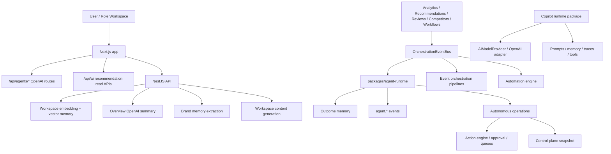
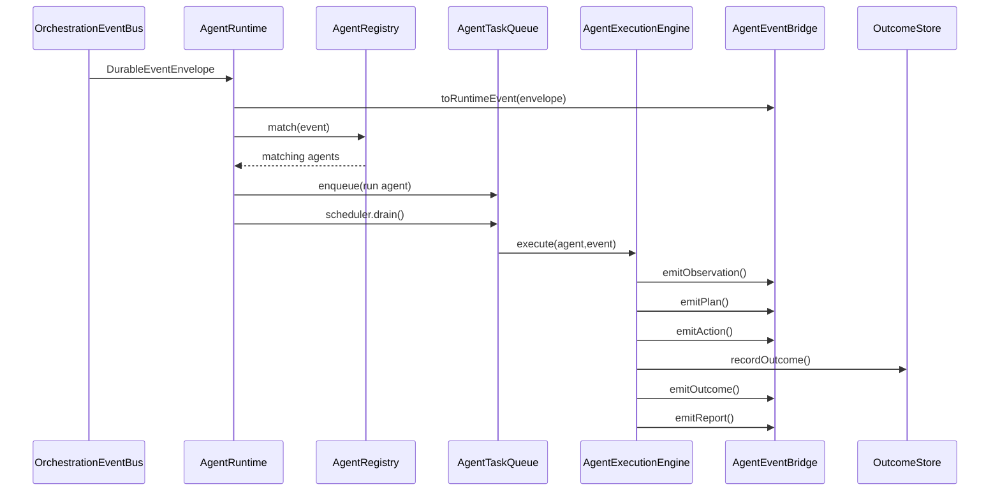
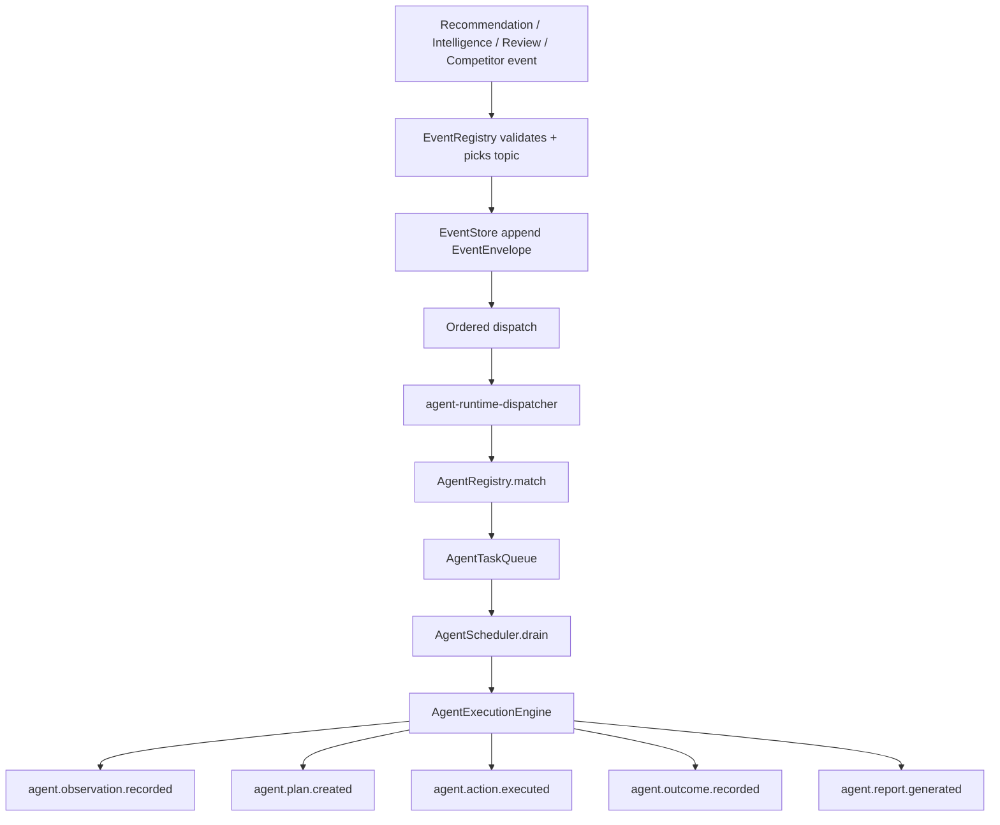
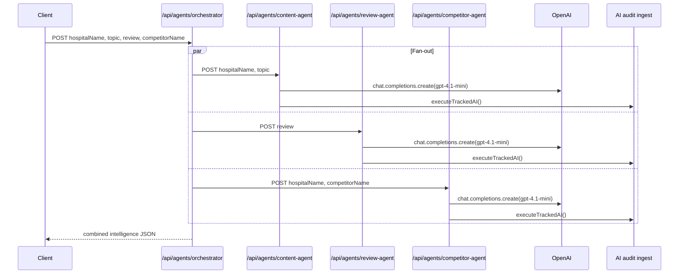
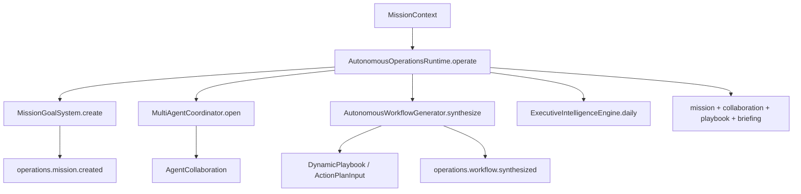
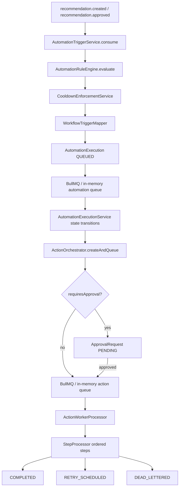
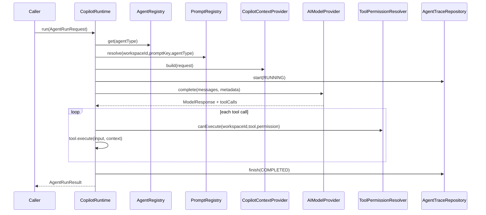
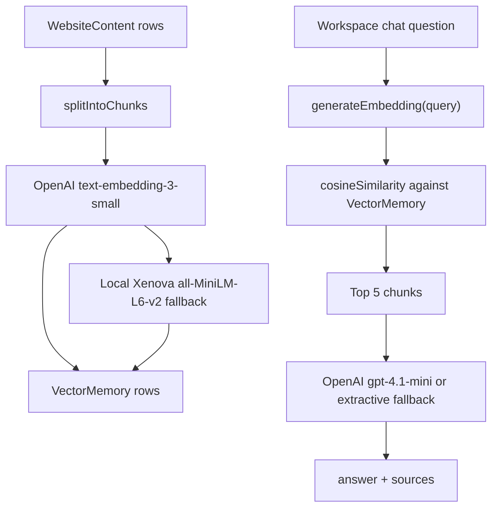
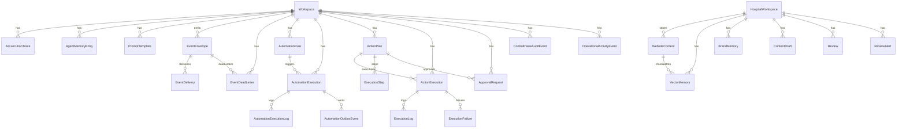

# VIP Agent Architecture Report

## 1. Executive Summary

VIP contains several agent-related systems that are currently at different maturity levels:

- **Implemented package-level agent runtime**: `packages/agent-runtime/src/index.ts` defines the main event-driven agent framework: agent definitions, registry, subscriptions, context loading, in-memory state, task queue, scheduler, execution engine, plan generation/revision/execution, event bridge, outcome recording, and seven default agent factory functions.
- **Implemented autonomous operations layer**: `packages/autonomous-operations/src/index.ts` adds multi-agent mission management, agent collaboration, consensus, workflow synthesis, executive briefings, cross-workspace learning, forecasting, strategy simulation, and control-plane snapshots.
- **Implemented event and workflow backbone**: `packages/event-orchestrator/src/*`, `packages/automation-engine/src/*`, and `packages/action-engine/*` provide durable events, subscribers, dead letters, automation triggers, BullMQ/in-memory queues, approval gates, retry scheduling, and action execution.
- **Implemented direct OpenAI API agents in the web app**: `apps/web/src/app/api/agents/content-agent/route.ts`, `review-agent/route.ts`, `competitor-agent/route.ts`, and `orchestrator/route.ts` expose simple Next.js API agents using OpenAI chat completions and audit tracking.
- **Implemented but not fully app-wired copilot runtime**: `packages/copilot-runtime/*` defines vendor-neutral copilot agents, prompt/memory/trace boundaries, tool permissions, and an OpenAI adapter. It is a reusable runtime package rather than the same system as the Next.js `/api/agents/*` endpoints.
- **Implemented RAG-like workspace memory in API**: `apps/api/src/workspace-embedding/workspace-embedding.service.ts` embeds website chunks into Prisma `VectorMemory`, searches by cosine similarity, and answers via OpenAI or local fallback.
- **Planned or placeholder AI providers**: OpenAI is the only provider with concrete SDK usage. Gemini, Vertex AI, Anthropic, and Google ADK appear as UI/planned/provider-health references only; no actual Vertex AI or Google ADK implementation was found in source.

The platform is best described as an **AI-native intelligence operating system under construction**: core package abstractions are strong and tested in isolation, but there are multiple parallel agent surfaces that are not yet unified into one production runtime.

## 2. Architecture Overview

### Primary layers

### Agent ecosystem categories

| Category | Status | Actual implementation | Notes |
|---|---:|---|---|
| Event-driven runtime agents | Implemented package foundation | `packages/agent-runtime/src/index.ts` | Seven agent factory functions exist; persistence defaults are in-memory unless adapters are provided. |
| Autonomous operations agents/control plane | Implemented package foundation | `packages/autonomous-operations/src/index.ts` | Coordinates missions, collaborations, consensus, synthesized workflows, forecasts, and snapshots. |
| Web API agents | Partial production | `apps/web/src/app/api/agents/*` | Direct OpenAI calls with hard-coded prompts and JSON parsing; not routed through `packages/agent-runtime`. |
| Copilot agents | Implemented runtime package, partially integrated | `packages/copilot-runtime/*` | Vendor-neutral runtime with prompt/memory/trace abstractions and OpenAI adapter. |
| UI mock/placeholder agents | Placeholder | `apps/web/src/app/admin/workspaces/[id]/social-agent/page.tsx`, `apps/web/src/app/admin/system/ai-health/page.tsx` | Render static or mock status content; not autonomous execution. |
| Future providers/integrations | Planned | `docs/admin-command-centre-architecture.md`, admin UI provider health copy | Google Business, Meta, Instagram, YouTube, OpenAI are shown as future cards in docs; Gemini/Vertex/Anthropic shown in UI health surfaces. |

## 3. Agent Inventory

### Package runtime agents

All package runtime agents share the same `AgentDefinition` contract with `id`, `kind`, optional `workspaceId`, description, subscriptions, capabilities, and modules. Required capabilities are `perception`, `planning`, `execution`, `reflection`, and `reporting`; `AgentRegistry.register()` rejects agents missing any required capability. Source: `packages/agent-runtime/src/index.ts`.

| Agent | Kind | Status | Purpose | Inputs / triggers | Outputs | Dependencies / storage |
|---|---|---:|---|---|---|---|
| Strategy Agent | `STRATEGY` | Implemented foundation, 70% | General strategy intelligence worker. | Subscribes to all `AGENT_EVENT_TYPES`: intelligence, recommendations, competitors, and reviews. | Observation, plan, actions, report, optional outcome. | `AgentRuntime`, `AgentStateStore`, `AgentEventBridge`, optional `OutcomeStore`; in-memory by default. |
| Competitor Agent | `COMPETITOR` | Implemented foundation, 65% | Competitor intelligence worker. | `competitor.signal.detected`, `competitor.benchmark.updated`, `intelligence.signal.raised`; entity type `COMPETITOR`. | Same runtime outputs. | Same runtime infrastructure; competitor events from event orchestrator. |
| Reputation Agent | `REPUTATION` | Implemented foundation, 65% | Review/reputation intelligence worker. | `review.received`, `review.sentiment.changed`, `review.risk.detected`, `intelligence.signal.raised`; entities `REVIEW`, `DOCTOR`. | Same runtime outputs. | Same runtime infrastructure; review events from event orchestrator. |
| Content Agent | `CONTENT` | Implemented foundation, 60% | Content intelligence worker. | `intelligence.signal.raised`, `intelligence.priority.created`, `intelligence.recommendation.reasoned`; entities `CONTENT`, `CAMPAIGN`. | Same runtime outputs. | Same runtime infrastructure. Separate web/API content generators exist outside this runtime. |
| Market Agent | `MARKET` | Implemented foundation, 60% | Market intelligence worker. | `intelligence.signal.raised`, `intelligence.causal_chain.detected`, `competitor.benchmark.updated`; entities `LOCATION`, `SPECIALTY`, `COMPETITOR`. | Same runtime outputs. | Same runtime infrastructure plus market/competitor events. |
| Doctor Growth Agent | `DOCTOR_GROWTH` | Implemented foundation, 60% | Doctor growth intelligence worker. | `intelligence.signal.raised`, `intelligence.priority.created`, `intelligence.recommendation.reasoned`; entities `DOCTOR`, `SPECIALTY`. | Same runtime outputs. | Same runtime infrastructure. |
| Executive Agent | `EXECUTIVE` | Implemented foundation, 65% | Executive intelligence worker. | `intelligence.priority.created`, `intelligence.recommendation.reasoned`, `intelligence.causal_chain.detected`; minimum severity `HIGH`. | Same runtime outputs. | Same runtime infrastructure and severity filtering. |

### Web API OpenAI agents

These agents are concrete HTTP endpoints, but they are not implemented through `packages/agent-runtime`.

| Agent | Endpoint/file | Status | Purpose | Inputs | Outputs | APIs/storage |
|---|---|---:|---|---|---|---|
| Content Agent API | `apps/web/src/app/api/agents/content-agent/route.ts` | Partial production, 55% | Generate hospital marketing headline/caption/hashtags. | `hospitalName`, `topic`, optional audit ids. | JSON `{ headline, caption, hashtags }`. | OpenAI `chat.completions.create`, model `gpt-4.1-mini`; audit via `apps/web/src/lib/ai-audit.ts`. |
| Review Agent API | `apps/web/src/app/api/agents/review-agent/route.ts` | Partial production, 55% | Analyze review sentiment, urgency, category, response. | `review`, optional audit ids. | JSON `{ sentiment, urgency, category, response }`. | OpenAI `chat.completions.create`, model `gpt-4.1-mini`; audit via API ingest. |
| Competitor Agent API | `apps/web/src/app/api/agents/competitor-agent/route.ts` | Partial production, 55% | Produce competitor strengths, gaps, campaign ideas, opportunities. | `hospitalName`, `competitorName`, optional audit ids. | JSON arrays. | OpenAI `chat.completions.create`, model `gpt-4.1-mini`; audit via API ingest. |
| Agent Orchestrator API | `apps/web/src/app/api/agents/orchestrator/route.ts` | Prototype, 40% | Fan out to content/review/competitor endpoints in parallel. | `hospitalName`, `topic`, `review`, `competitorName`. | Combined `intelligence` object. | Hard-coded `http://localhost:3000`; no retry, auth, dynamic base URL, or runtime registry. |

### Copilot runtime agents

`packages/copilot-runtime/agents/default-agents.ts` defines these typed agents. `packages/copilot-runtime/runtime/copilot-runtime.ts` runs them via `AIModelProvider`, prompt registry, context provider, trace repository, tool permission resolver, and optional tools.

| Agent | Status | Purpose | Allowed tools | Prompt key | Storage |
|---|---:|---|---|---|---|
| Strategy Analyst | Implemented runtime package, 65% | Explain recommendations and synthesize business evidence. | `dashboard.read`, `recommendation.read` | `strategy-analyst` | `AIExecutionTrace`, `AgentMemoryEntry`, `PromptTemplate` via Prisma store. |
| Growth Agent | Implemented runtime package, 65% | Recommend measurable growth experiments. | `dashboard.read`, `action.propose` | `growth-agent` | Same copilot store boundaries. |
| Content Agent | Implemented runtime package, 60% | Prepare approved content implementation sequences. | `action.propose` | `content-agent` | Same copilot store boundaries. |
| Risk Monitor | Implemented runtime package, 60% | React to risk events and recommend mitigation. | `dashboard.read`, `alert.create` | `risk-monitor` | Same copilot store boundaries. |
| Campaign Optimizer | Implemented runtime package, 60% | Optimize active campaigns against outcomes. | `dashboard.read`, `action.propose` | `campaign-optimizer` | Same copilot store boundaries. |

### Autonomous operations systems

These are not single LLM agents. They are deterministic multi-agent coordination and operating-system services in `packages/autonomous-operations/src/index.ts`.

| System | Status | Responsibility | Inputs | Outputs |
|---|---:|---|---|---|
| `MultiAgentCoordinator` | Implemented foundation, 75% | Opens collaborations, sends agent messages, computes consensus, delegates tasks to agent queues. | Participants, mission/topic, messages, votes. | `AgentCollaboration`, `AgentMessage`, `operations.agent.message.sent`, `operations.consensus.reached`. |
| `MissionGoalSystem` | Implemented foundation, 70% | Creates mission goals, decomposes priorities across agents, tracks task progress. | Objective, horizon, entities, metrics, agents, priorities. | `MissionGoal`, `operations.mission.created`, `operations.mission.progressed`. |
| `AutonomousWorkflowGenerator` | Implemented foundation, 70% | Converts mission/recommendation context into an `ActionPlanInput` playbook. | `MissionContext`, recommendation, approval threshold, adaptive plan. | `DynamicPlaybook`, `operations.workflow.synthesized`. |
| `ExecutiveIntelligenceEngine` | Implemented wrapper, 65% | Produces daily and weekly strategic briefings. | Priorities, outcomes, recommendations, patterns, forecasts. | `ExecutiveBriefing` and weekly summaries. |
| `CrossWorkspaceLearningLayer` | Implemented in-memory, 60% | Sanitizes tenant patterns and generates anonymized benchmarks. | Patterns, specialty, strategy, outcome count. | `CrossWorkspaceBenchmark`; throws if tenant diversity is insufficient. |
| `ForecastingSimulationEngine` | Implemented deterministic, 65% | Forecasts KPI/reputation/market/strategy targets and simulates strategy scenarios. | Observations, outcomes, signals, causal findings, strategy. | `ForecastResult`, `StrategySimulation`, `operations.forecast.generated`. |
| `UnifiedIntelligenceControlPlane` | Implemented foundation, 70% | Records workflows/forecasts/replay events and snapshots state. | Agents, missions, patterns, benchmarks, optional agent states. | `ControlPlaneSnapshot`, `operations.control_plane.snapshot`. |

### UI-only and placeholder agents

| Surface | Status | Evidence |
|---|---:|---|
| VIP Autonomous Social Agent page | UI-only placeholder, 20% | `apps/web/src/app/admin/workspaces/[id]/social-agent/page.tsx` defines hard-coded `memory`, `trends`, and `plan` arrays inside a client component. |
| Mission Control AI Copilot link | Mock UI, 15% | `apps/web/src/app/admin/workspaces/[id]/mission-control/page.tsx` marks AI Copilot nav state as `"mock"`. |
| Admin AI Health provider list | Mock/planned signal, 20% | `apps/web/src/app/admin/system/ai-health/page.tsx` displays “OpenAI, Gemini, Vertex, Anthropic”; concrete provider code exists only for OpenAI. |
| Admin integrations future cards | Planned | `docs/admin-command-centre-architecture.md` says integrations are read-only future cards for Google Business, Meta, Instagram, YouTube, and OpenAI. |

## 4. Technical Deep Dive

### Agent lifecycle

`packages/agent-runtime/src/index.ts` defines lifecycle states `REGISTERED`, `IDLE`, `RUNNING`, `PAUSED`, `FAILED`, and `STOPPED`. The runtime flow is:

1. `AgentRuntime.start()` subscribes `agent-runtime-dispatcher` to event topics `intelligence`, `recommendations`, `competitors`, and `reviews`.
2. `AgentEventBridge.toRuntimeEvent()` converts a durable event envelope into `RuntimeInputEvent`.
3. `AgentRegistry.match()` selects agents by workspace, event types, entity filters, predicates, and severity threshold.
4. `AgentTaskQueue.enqueue()` creates idempotent queued tasks with retry and escalation policies.
5. `AgentScheduler.drain()` executes due tasks synchronously in the current process.
6. `AgentExecutionEngine.execute()` marks the agent running, builds context, observes, emits observation, generates or revises a plan, executes plan steps, reflects, records outcome, emits report, and marks the agent idle or failed.

### Default module behavior

`createDefaultAgentModules()` is deterministic and not model-backed. It:

- Extracts entities, signals, priorities, recommendations, causal findings, evidence, and confidence from event payloads.
- Uses `PlanGenerator` to create steps for every capability except perception.
- Executes each step by returning `{ accepted: true, action, input }`.
- Reflects with confidence `0.8` unless an action failed, then emits an `OutcomeRecord`.
- Reports action ids, observation ids, outcome summaries, and reasoning strings.

This means the package-level runtime is a functional orchestration framework, but not a live LLM planning system unless custom modules are injected.

### Task queue, retry, and escalation

`AgentTaskQueue` is in-memory. It deduplicates by completed idempotency key and active matching idempotency key. Failed tasks become `RETRYING` with `runAfter = now + backoffMs` until `task.attempt >= retryPolicy.maxAttempts`, then become `ESCALATED` if an escalation policy exists or `FAILED` otherwise. `AgentScheduler.drain()` processes due tasks immediately in loop order.

There is no durable database table for package-level `AgentTask`, `AgentPlan`, or `AgentState` in `packages/agent-runtime`; persistence is interface-based and defaults to `InMemoryAgentStateRepository`.

### Event orchestration

`packages/event-orchestrator/src/bus/index.ts` implements `OrchestrationEventBus`:

- Validates event schemas through `EventRegistry`.
- Deduplicates by `eventId` via `EventStore.findByEventId()`.
- Creates `DurableEventEnvelope` with topic, priority, metadata, sequence, and `PENDING` state.
- Persists to `EventStore`.
- Dispatches in aggregate order using a workspace/aggregate key.
- Marks dispatch state `DISPATCHING`, then `DELIVERED` or `DEAD_LETTERED`.

`packages/event-orchestrator/src/services/index.ts` provides `InMemoryEventStore` and `PrismaEventStore`. The Prisma-backed store maps to `EventEnvelope`, `EventDelivery`, and `EventDeadLetter` in `packages/database/prisma/schema.prisma`.

`packages/event-orchestrator/src/transport/index.ts` provides `PriorityEventTransport` and `RedisEventTransport`. `PriorityEventTransport` is in-memory; `RedisEventTransport` uses a Redis-like client with priority-specific lists plus a failed list.

### Event pipelines

`packages/event-orchestrator/src/pipelines/index.ts` registers these routing pipelines:

- analytics -> recommendations
- recommendations -> automation
- automation -> insights
- analytics -> alerts
- competitors -> recommendations
- reviews -> recommendations
- workflows -> analytics
- optional platform events -> signals
- optional cognitive signals -> graph
- optional signals -> priorities
- optional priorities -> recommendations
- optional causal findings -> recommendations

### Automation framework

`packages/automation-engine/src/services/automation-trigger-service.ts` consumes `RecommendationLifecycleEvent`, lists enabled automation rules, evaluates them with `AutomationRuleEngine`, enforces cooldown, maps the recommendation through a `WorkflowTriggerMapper`, creates an `AutomationExecution`, and persists an `automation.triggered` event/log.

`packages/automation-engine/src/execution/automation-execution-service.ts` implements state transitions:

- `start()` from `QUEUED`, `SCHEDULED`, or `RETRYING` to `RUNNING`.
- `schedule()` to `SCHEDULED`.
- `fail()` to `RETRYING` or `FAILED` based on retry policy and dead-letter threshold.
- `complete()` to `COMPLETED`.
- `rollBack()` to `ROLLED_BACK`.
- `deadLetter()` to `DEAD_LETTERED`.

`packages/automation-engine/src/queue/bullmq-automation-queue.ts` and `bullmq-automation-consumer.ts` provide BullMQ queues `vip-automations` and `vip-automations-dead-letter`; package exports also include in-memory queue paths.

### Action execution framework

`packages/action-engine/orchestration/action-orchestrator.ts` creates action plans, checks idempotency, creates approval requests when `requiresApproval` is true, queues approved/non-approval plans, supports scheduled and recurring plans, and emits plan events.

`packages/action-engine/workers/action-worker-processor.ts` starts executions, runs ordered steps by registered `StepProcessor`, pauses on approval-required steps until approval is granted, retries with exponential backoff, schedules retry jobs, or dead-letters failed jobs.

`packages/action-engine/queue/bullmq-action-queue.ts` provides BullMQ queues `vip-actions` and `vip-actions-dead-letter`, with enqueue, schedule, repeat, and dead-letter methods.

## 5. Data Flow Diagrams

### Event-driven package runtime flow

### Next.js API orchestrator fan-out

### Autonomous operations flow

### Automation/action execution flow

## 6. Sequence Diagrams

### Copilot runtime run sequence

### Workspace memory/RAG flow

## 7. Database Analysis

VIP has two Prisma schemas in the workspace:

- `packages/database/prisma/schema.prisma`: package-level shared schema with `Workspace`, AI recommendation/action/automation/event/copilot tables, and operational tables.
- `apps/api/prisma/schema.prisma`: API app schema for hospital workspaces, content, reviews, website content, and vector memory.

### Agent-related ERD

### Key package-level tables

| Table/model | Purpose | Source |
|---|---|---|
| `AIExecutionTrace` | Stores AI/copilot run status, model, inputs/outputs, tool calls, prompt key/version, token counts, latency, and errors. | `packages/database/prisma/schema.prisma` |
| `AgentMemoryEntry` | Stores scoped JSON memory per workspace and `AIAgentType`. | `packages/database/prisma/schema.prisma` |
| `PromptTemplate` | Stores active prompt templates per workspace, key, version, and agent type. | `packages/database/prisma/schema.prisma` |
| `EventEnvelope`, `EventDelivery`, `EventDeadLetter` | Durable event log, subscriber deliveries, and failed delivery records. | `packages/database/prisma/schema.prisma`; `packages/event-orchestrator/src/services/index.ts` |
| `AutomationRule`, `AutomationWorkflowMapping`, `AutomationExecution`, `AutomationExecutionLog`, `AutomationOutboxEvent` | Automation trigger rules, workflow mappings, execution state, logs, and outbox events. | `packages/database/prisma/schema.prisma`; `packages/automation-engine/src/*` |
| `ActionPlan`, `ActionExecution`, `ExecutionStep`, `ExecutionLog`, `ExecutionFailure`, `ApprovalRequest`, `ActionOutboxEvent` | Human-gated action plans, execution tracking, retry/failure logs, approvals, and outbox events. | `packages/database/prisma/schema.prisma`; `packages/action-engine/*` |
| `ControlPlaneAuditEvent` | Control-plane audit trail. | `packages/database/prisma/schema.prisma` |

### API app memory/content tables

| Table/model | Purpose | Source |
|---|---|---|
| `HospitalWorkspace` | Hospital workspace root for API app. | `apps/api/prisma/schema.prisma`; also mirrored in `packages/database/prisma/schema.prisma`. |
| `WebsiteContent` | Raw website source content. | `apps/api/src/workspace-embedding/workspace-embedding.service.ts` |
| `VectorMemory` | Stores chunk text and JSON embedding for workspace search. | `apps/api/prisma/schema.prisma`; `apps/api/src/workspace-embedding/workspace-embedding.service.ts` |
| `BrandMemory` | Stores extracted hospital brand/tone/topics/hashtags/content patterns. | `packages/database/prisma/schema.prisma`; `apps/api/src/brand-memory/*` |
| `ContentDraft`, `ContentCalendarItem`, `ContentCalendarScript`, `ContentGeneratorRun` | Content production and generated content records. | `packages/database/prisma/schema.prisma`; content docs and API services. |
| `Review`, `ReviewAlert` | Review intelligence inputs and alert records. | `packages/database/prisma/schema.prisma`; overview aggregation. |

## 8. API Analysis

### Web app agent APIs

| Route | Method | Status | Behavior |
|---|---|---:|---|
| `apps/web/src/app/api/agents/content-agent/route.ts` | POST | Partial | Calls OpenAI `gpt-4.1-mini`, asks for valid JSON headline/caption/hashtags, parses raw JSON, returns `{ success, content }`. |
| `apps/web/src/app/api/agents/review-agent/route.ts` | POST | Partial | Calls OpenAI `gpt-4.1-mini`, asks for review analysis JSON, parses raw JSON, returns `{ success, analysis }`. |
| `apps/web/src/app/api/agents/competitor-agent/route.ts` | POST | Partial | Calls OpenAI `gpt-4.1-mini`, asks for competitor analysis JSON, parses raw JSON, returns `{ success, analysis }`. |
| `apps/web/src/app/api/agents/orchestrator/route.ts` | POST | Prototype | Calls the above three endpoints using `Promise.all()` and hard-coded `http://localhost:3000`. |
| `apps/web/src/app/api/test-agent/route.ts` | POST | Test/prototype | OpenAI-backed test endpoint with audit tracking. |

### Recommendation read APIs

`apps/web/src/app/api/ai/_lib/service.ts` implements `AiRecommendationReadService` over a repository interface:

- `recommendations(query)` returns paginated serialized recommendations.
- `insights(query)` summarizes status/priority/risk/engagement opportunities.
- `explanations(query)` returns explanation payloads.
- `opportunities(query)` returns highest value, growth, critical recovery, and automation-ready recommendations.

This is read-side intelligence, not autonomous execution.

### NestJS AI APIs/services

| Service | Status | AI behavior |
|---|---:|---|
| `apps/api/src/workspace-embedding/workspace-embedding.service.ts` | Implemented | OpenAI embeddings/chat, local embedding fallback via `@xenova/transformers`, extractive chat fallback, Prisma `VectorMemory`. |
| `apps/api/src/workspace-content/workspace-content.service.ts` | Partial production | OpenAI content generation with local fallback; stores `ContentDraft`. |
| `apps/api/src/brand-memory/brand-memory-ai.service.ts` | Partial production | OpenAI JSON extraction with deterministic fallback. |
| `apps/api/src/overview/overview-aggregation.service.ts` | Partial production | Permission-filtered overview cards and OpenAI executive summary through responses API; deterministic fallback. |
| `apps/api/src/ai-audit/*` | Implemented support | Tracks provider/model usage, tokens, cost/pricing, latency, status, and errors. |

## 9. AI Infrastructure Analysis

### Providers and models found

| Provider/model | Actual usage | Source |
|---|---|---|
| OpenAI `gpt-4.1-mini` | Web API agents, NestJS workspace chat/content, brand memory extraction, overview summaries. | `apps/web/src/app/api/agents/*`, `apps/api/src/workspace-embedding/workspace-embedding.service.ts`, `apps/api/src/workspace-content/workspace-content.service.ts`, `apps/api/src/brand-memory/brand-memory-ai.service.ts`, `apps/api/src/overview/overview-aggregation.service.ts` |
| OpenAI `text-embedding-3-small` | Workspace vector memory embedding. | `apps/api/src/workspace-embedding/workspace-embedding.service.ts`; pricing seed migrations. |
| OpenAI configurable model | `OPENAI_MODEL` or `OVERVIEW_OPENAI_MODEL` appear in web/overview helper code. | `apps/web/src/lib/phase-e/server.ts`, `apps/api/src/overview/overview-aggregation.service.ts` |
| Local Xenova `all-MiniLM-L6-v2` | Embedding fallback when OpenAI quota/key/rate-limit errors occur. | `apps/api/src/workspace-embedding/workspace-embedding.service.ts` |

### Providers not actually implemented

| Provider/integration | Status | Evidence |
|---|---:|---|
| Vertex AI | Planned/placeholder only | Search found UI/provider-health mentions, no Vertex SDK/client/service implementation. |
| Google ADK | Absent | Search found no implementation beyond requested future-readiness target. |
| Gemini | Placeholder only | Mentioned in provider health UI text, no concrete SDK usage. |
| Anthropic | Placeholder only | Mentioned in provider health UI text, no concrete SDK usage. |
| Vector database | Not implemented as external vector DB | Embeddings are stored as JSON in Prisma `VectorMemory`; similarity is computed in application code with `cosineSimilarity`. |

### Prompt management

There are two prompt styles:

- **Database-backed copilot prompt templates**: `PromptTemplate` model in `packages/database/prisma/schema.prisma`; `PromptRegistry` and `PrismaCopilotStore` in `packages/copilot-runtime/persistence/prisma-copilot-store.ts`.
- **Inline prompts**: Next.js agent routes and NestJS AI services embed system/user prompts directly in code.

### Context and memory

- `AgentContextManager` loads active plans and `AgentMemorySnapshot` through `AgentMemoryBridge`; default bridge is null and `OutcomeAgentMemoryBridge` loads outcomes from `OutcomeStore`.
- `OutcomeStore`, `OutcomeTimeline`, `OutcomeLinking`, `OutcomeCorrelation`, and `EpisodicMemory` live in `packages/outcome-memory/src/index.ts`.
- Copilot runtime context comes from `CopilotContextProvider`; memory entries are typed in `packages/copilot-runtime/types/index.ts`.
- Workspace RAG memory uses `WebsiteContent` and `VectorMemory` in the API app.

### Tool calling

- Copilot tool calls are modeled by `ToolCallRequest` and `ToolDefinition`; `CopilotRuntime.executeTools()` checks whether each requested tool exists, is allowed by the agent definition, and passes `ToolPermissionResolver.canExecute()`.
- `packages/copilot-runtime/integration/action-proposal-tool.ts` submits action proposals into `@vip/action-engine`, making it the clearest bridge from AI/copilot suggestions to governed workflow execution.
- The direct Next.js OpenAI agent routes do not use OpenAI tool calling; they request JSON text and parse it.

## 10. Role-Based Intelligence System

```mermaid
graph TD
    Owner["Owner / Admin"] --> Executive["Executive Agent / Overview AI / Strategy workspace"]
    Owner --> Control["Control plane / workflows / automation"]
    Doctor["Doctor"] --> Reputation["Reputation + review intelligence"]
    Doctor --> Approval["Clinical approval queues"]
    Staff["Staff"] --> Ops["Operational tasks / handoffs"]
    Marketing["Marketing"] --> Content["Content Agent / Content calendar / Script studio"]
    Marketing --> Social["Social intelligence / UI social-agent placeholder"]
    Production["Production"] --> Campaigns["Campaign execution / media / workflow surfaces"]
    Operations["Operations"] --> Automation["Automation engine / action engine / event monitoring"]
```

| Role | Available implemented intelligence | Automation/actions | Status notes |
|---|---|---|---|
| Owner/Admin | Overview aggregation, AI recommendations read APIs, admin intelligence pages, package Executive Agent, control-plane snapshots. | Workflow/admin pages, approval/governance surfaces, action/automation engines. | Many admin pages are UI surfaces over mixed live/mock data; package control plane is foundation-level. |
| Doctor | Review/reputation intelligence concepts, clinical approval queue components, doctor workspace. | Approval gates through `ApprovalRequest` and content/script approvals. | Doctor Growth Agent exists in package runtime; not confirmed as fully wired to doctor UI. |
| Staff | Staff workspace, operational tasks/handoffs, upload workflow surfaces. | Operational tasks and notifications. | Mostly UI/operational data surfaces, not direct autonomous agent execution. |
| Marketing | Content API agent, content calendar, content generator, brand memory, workspace content generation. | Content calendar/script workflows; content generation runs. | Direct content agent is OpenAI-backed; social-agent page is static placeholder. |
| Production | Production workspace, campaigns, media assets, publishing/workflow surfaces. | Action engine and approval/scheduled/recurring execution support. | Production pages show workflow status; actual publishing integrations are not shown as implemented. |
| Operations | Automation engine, action engine, event orchestrator, operational activities, notifications, errors. | BullMQ/in-memory queues, retry/dead-letter, approvals. | Strong package foundations; production deployment wiring needs audit. |

## 11. Business Intelligence Agents

| Area | Implemented components | Objectives/KPIs | Outputs |
|---|---|---|---|
| Analytics | `packages/analytics-intelligence`, overview aggregation, event pipelines analytics -> recommendations/alerts. | Trends, anomalies, predictions, risk, conversion/patient growth signals. | Signals, insights, recommendation inputs, overview metrics. |
| Growth | `GROWTH_AGENT` in copilot runtime, package Strategy/Executive/Doctor Growth agents, recommendation engines. | Growth experiments, opportunities, patient acquisition. | Recommendations, briefings, action proposals. |
| Marketing/content | Web content agent, NestJS content generation, content calendar/script/generator tables, package Content Agent. | Content production, education, campaign execution, brand consistency. | Drafts, captions, hashtags, calendar items, generated runs. |
| SEO/online presence | Admin SEO/GBP/trend intelligence pages, strategy pages. | Discoverability, local presence, reputation. | Mostly UI strategy/intelligence surfaces; no dedicated SEO autonomous agent found. |
| Social media | Social engine package, social intelligence pages, static social-agent page. | Social trends, content planning, publishing readiness. | Social analytics/intelligence surfaces; social-agent page is placeholder. |
| Competitor intelligence | Package Competitor Agent, web competitor-agent route, market-intelligence competitor reports, event pipeline competitors -> recommendations. | Strength/gap/opportunity detection. | Competitor analysis JSON, recommendation inputs, reports. |
| Customer/reputation intelligence | Package Reputation Agent, web review-agent route, review tables/alerts, review strategy pages. | Sentiment, urgency, categories, complaint/risk response. | Review analysis JSON, alerts, recommendations. |
| Revenue/operations intelligence | Overview aggregation, operational packages, action/automation engine. | Workflow health, execution failures, recommendations, approvals. | Overview cards, quick actions, logs, outbox events, operational surfaces. |

## 12. Current Implementation Status

| System | Completion | Status | Bottlenecks / technical debt |
|---|---:|---|---|
| `packages/agent-runtime` | 70% | Implemented framework | Default modules are deterministic; persistence is in-memory by default; no confirmed production registration/bootstrap. |
| Package default agents | 60-70% | Implemented factory definitions | Agent-specific intelligence is mostly subscription/filter definitions plus shared modules unless custom modules are injected. |
| `packages/autonomous-operations` | 70% | Implemented foundation | In-memory state for missions/collaborations/workflows/forecasts; needs durable repository integration and app wiring. |
| `packages/event-orchestrator` | 80% | Implemented backbone | Strong abstractions and Prisma store; deployment/worker topology must be confirmed. |
| `packages/automation-engine` | 75% | Implemented | BullMQ and state machine exist; production worker/runtime wiring needs deployment verification. |
| `packages/action-engine` | 75% | Implemented | Approval, scheduled, recurring, retry, dead-letter support exist; actual processor catalog/integrations need expansion. |
| `packages/copilot-runtime` | 65% | Implemented package | Runtime is vendor-neutral and traceable; not the same as `/api/agents` and app-level usage appears incomplete. |
| Web `/api/agents/*` | 55% | Partial production/prototype | Hard-coded prompts, raw JSON parsing, limited validation, no shared runtime registry, orchestrator uses hard-coded localhost. |
| NestJS workspace embedding/RAG | 75% | Implemented | Uses JSON vector storage and application-level cosine search rather than a vector index; local fallback is present. |
| OpenAI audit tracking | 75% | Implemented support | Web audit posts to API; API tracker handles model usage/pricing. Need verify ingest security/deployment. |
| Vertex AI / Google ADK | 0-5% | Not implemented | No concrete SDK/service code found. |
| Gemini / Anthropic | 5% | Placeholder | UI/provider-health references only. |
| Social autonomous agent | 20% | UI placeholder | Static arrays; no agent runtime, provider, storage, or scheduling. |

## 13. Scalability Assessment

### Strengths

- Event bus supports durable envelopes, topic routing, aggregate ordering, delivery tracking, dead letters, priority inference, and replay queries.
- Automation/action engines include idempotency, retries, approval gating, scheduling, recurring jobs, and BullMQ implementations.
- Copilot runtime separates model provider, prompt registry, memory/context, trace repository, tool permissions, and tool execution.
- Workspace memory has local fallback paths for embeddings and chat, which reduces total OpenAI dependency during quota failures.

### Scalability concerns

- Package-level agent runtime defaults to in-memory queues/state. Without a durable repository and worker process model, agent state and tasks are not resilient across restarts.
- The Next.js `/api/agents/orchestrator` hard-codes `http://localhost:3000`, making it unsuitable for deployed environments as-is.
- Web API agents parse raw model output with `JSON.parse()` and no schema validation or repair path.
- Workspace vector search stores embeddings as JSON and computes cosine similarity in application memory; this will not scale well for large content volumes.
- Multiple agent systems exist in parallel: package runtime agents, copilot runtime agents, direct web OpenAI routes, NestJS AI services, and UI mock agents. There is not yet a single source of truth for agent execution.
- Provider health UI mentions providers not implemented in backend/provider adapters, which can overstate current capability.

## 14. Recommended Improvements

1. **Unify agent execution paths**
   - Route web `/api/agents/*` use cases through either `packages/agent-runtime` or `packages/copilot-runtime`.
   - Keep one registry of active agents, model-backed agents, and placeholder/planned agents.

2. **Add durable agent state and task persistence**
   - Implement a Prisma-backed `AgentStateRepository` and durable task queue for `packages/agent-runtime`.
   - Persist agent plans, executions, and lifecycle state alongside `AIExecutionTrace` and event envelopes.

3. **Harden OpenAI route outputs**
   - Add Zod schemas for content/review/competitor outputs.
   - Use structured outputs where possible instead of raw JSON prompts.
   - Add fallback responses and failure classifications.

4. **Replace hard-coded local orchestrator URL**
   - Use relative fetches or environment-driven base URLs in `apps/web/src/app/api/agents/orchestrator/route.ts`.

5. **Upgrade vector memory**
   - Add a real vector index or database extension when workspace memory grows.
   - Store embedding metadata, model name, hash, and version consistently.

6. **Make provider readiness honest and observable**
   - Mark Gemini, Vertex, Anthropic, and Google ADK as not configured until concrete adapters exist.
   - Extend provider-health checks to actual clients/adapters, not UI constants.

7. **Close the package-to-app wiring gap**
   - Add bootstrap code that registers runtime agents, attaches event bus subscribers, and starts workers in API/server processes.
   - Add operational UI for agent plans, task queue status, retries, failures, and emitted reports.

## 15. Roadmap Recommendations

### Near term

- Fix `/api/agents/orchestrator` base URL and add output validation.
- Create production bootstrap for event orchestrator + agent runtime + automation/action workers.
- Add Prisma-backed agent state repository.
- Document which admin/role pages are live, mock, or planned in the UI itself.

### Mid term

- Consolidate direct web agents into copilot/runtime agents.
- Connect `AutonomousWorkflowGenerator` output directly to `ActionOrchestrator.createAndQueue()`.
- Add model/provider registry with OpenAI as the first concrete provider and explicit feature flags for non-OpenAI providers.
- Replace JSON vector memory search with scalable vector indexing.

### Future readiness

| Capability | Existing foundation | Still needed |
|---|---|---|
| Google ADK integration | Agent definitions, events, task queue, tools, memory, traces. | ADK adapter, agent bootstrap, tool mapping, eval/test harness. |
| Vertex AI integration | Provider boundary in copilot runtime. | Vertex model provider adapter, credentials/config, health checks, model routing. |
| Multi-agent orchestration | `MultiAgentCoordinator`, missions, consensus, event bus. | Durable collaboration store, UI, runtime workers, richer negotiation policies. |
| Social Media Acquisition Agents | Content/social/market packages, content calendar, static social-agent UI. | Real social platform integrations, scheduling/publishing adapters, acquisition KPIs, autonomous execution. |
| NotebookLM Research Agents | Knowledge source/vector memory concepts. | Research ingestion connectors, source citation model, research agent prompt/tooling. |
| Growth Intelligence Agents | Growth copilot definition, strategy/recommendation engines, learning engine. | Live data feeds, experiments, outcome attribution, action execution wiring. |
| Autonomous Business Operators | Action/automation engines, approvals, mission system, control plane. | Durable operating loop, safeguards, role permissions, monitoring, rollback policies. |

## 16. Source Code Mapping

| Agent/system | Files | Services/classes | APIs/events | Database tables |
|---|---|---|---|---|
| Runtime agents | `packages/agent-runtime/src/index.ts` | `AgentRuntime`, `AgentExecutionEngine`, `AgentRegistry`, `AgentTaskQueue`, `AgentScheduler`, `AgentEventBridge`, agent factory functions | `agent.observation.recorded`, `agent.plan.created`, `agent.action.executed`, `agent.report.generated`, `agent.outcome.recorded` | No concrete agent tables; uses in-memory repository by default and optional `OutcomeStore`. |
| Strategy/Competitor/Reputation/Content/Market/Doctor Growth/Executive agents | `packages/agent-runtime/src/index.ts` | `createStrategyAgent`, `createCompetitorAgent`, `createReputationAgent`, `createContentAgent`, `createMarketAgent`, `createDoctorGrowthAgent`, `createExecutiveAgent` | Subscriptions to intelligence, recommendation, competitor, review events | Outcome records if `OutcomeStore` is provided. |
| Autonomous operations | `packages/autonomous-operations/src/index.ts` | `MultiAgentCoordinator`, `MissionGoalSystem`, `AutonomousWorkflowGenerator`, `UnifiedIntelligenceControlPlane`, `ForecastingSimulationEngine` | `operations.*` events | In-memory in package; `ControlPlaneAuditEvent` and operational tables exist in shared schema. |
| Copilot runtime agents | `packages/copilot-runtime/runtime/copilot-runtime.ts`, `packages/copilot-runtime/agents/default-agents.ts`, `packages/copilot-runtime/types/index.ts` | `CopilotRuntime`, `DefaultAgentRegistry`, `OpenAIProviderAdapter` | Model provider `complete/stream`, tool calls | `AIExecutionTrace`, `AgentMemoryEntry`, `PromptTemplate`. |
| Web content agent | `apps/web/src/app/api/agents/content-agent/route.ts` | Next.js POST handler | OpenAI chat completions, `executeTrackedAI` | AI audit ingest in API. |
| Web review agent | `apps/web/src/app/api/agents/review-agent/route.ts` | Next.js POST handler | OpenAI chat completions, `executeTrackedAI` | AI audit ingest in API. |
| Web competitor agent | `apps/web/src/app/api/agents/competitor-agent/route.ts` | Next.js POST handler | OpenAI chat completions, `executeTrackedAI` | AI audit ingest in API. |
| Web agent orchestrator | `apps/web/src/app/api/agents/orchestrator/route.ts` | Next.js POST handler | HTTP fan-out to three local agent routes | None directly. |
| Event orchestrator | `packages/event-orchestrator/src/bus/index.ts`, `services/index.ts`, `pipelines/index.ts`, `transport/index.ts`, `dto/index.ts` | `OrchestrationEventBus`, `PrismaEventStore`, `InMemoryEventStore`, `PriorityEventTransport`, `RedisEventTransport` | All `OrchestratedEvent` types, routing pipelines | `EventEnvelope`, `EventDelivery`, `EventDeadLetter`. |
| Automation engine | `packages/automation-engine/src/services/automation-trigger-service.ts`, `execution/automation-execution-service.ts`, `queue/*` | `AutomationTriggerService`, `AutomationExecutionService`, `BullMqAutomationQueue`, `BullMqAutomationConsumer` | `automation.triggered`, `automation.completed`, `automation.failed`, `automation.dead_lettered` and related lifecycle events | `AutomationRule`, `AutomationWorkflowMapping`, `AutomationExecution`, `AutomationExecutionLog`, `AutomationOutboxEvent`. |
| Action engine | `packages/action-engine/orchestration/action-orchestrator.ts`, `workers/action-worker-processor.ts`, `queue/bullmq-action-queue.ts` | `ActionOrchestrator`, `ActionWorkerProcessor`, `BullMqActionQueue` | `action.approval.requested`, `action.plan.queued`, `action.execution.completed`, retry/dead-letter events | `ActionPlan`, `ActionExecution`, `ExecutionStep`, `ExecutionLog`, `ExecutionFailure`, `ApprovalRequest`, `ActionOutboxEvent`. |
| Outcome memory | `packages/outcome-memory/src/index.ts` | `OutcomeStore`, `OutcomeTimeline`, `OutcomeLinking`, `OutcomeCorrelation`, `EpisodicMemory` | Outcome lineage and timeline APIs | In-memory package repository; runtime can emit `agent.outcome.recorded`; shared schema has AI/operational outcome-related tables. |
| Learning engine | `packages/learning-engine/src/index.ts` | `RecommendationOutcomeAnalyzer`, `StrategyLearningEngine`, `ConfidenceEngine`, `PatternDiscoveryEngine`, `ExecutiveBriefingGenerator` | Learning summaries and briefing generation | In-memory `LearningMemory` by default. |
| Workspace RAG/memory | `apps/api/src/workspace-embedding/workspace-embedding.service.ts` | `WorkspaceEmbeddingService` | OpenAI embeddings/chat, Xenova fallback, cosine search | `WebsiteContent`, `VectorMemory`. |
| Brand/content AI | `apps/api/src/brand-memory/brand-memory-ai.service.ts`, `apps/api/src/workspace-content/workspace-content.service.ts` | `BrandMemoryAIService`, `WorkspaceContentService` | OpenAI chat completions with fallback | `BrandMemory`, `ContentDraft`, content calendar/generator tables. |
| Overview AI | `apps/api/src/overview/overview-aggregation.service.ts`, `overview-openai.provider.ts` | `OverviewAggregationService` | OpenAI responses API, permission-filtered facts | Reads hospital, reviews, signals, priorities, recommendations, outcomes, content calendar/generator runs. |
| UI social agent placeholder | `apps/web/src/app/admin/workspaces/[id]/social-agent/page.tsx` | `SocialAgent` React component | None | None. |

## 17. Verification Notes

- Code-location index for the most important implementation anchors:
  - `packages/agent-runtime/src/index.ts:358` `AgentRegistry`; `:410` `AgentTaskQueue`; `:589` `AgentExecutionEngine`; `:711` `AgentRuntime`; `:774` `createStrategyAgent`; `:798` `createExecutiveAgent`; `:802` `createDefaultAgentModules`.
  - `packages/autonomous-operations/src/index.ts:250` `MultiAgentCoordinator`; `:324` `MissionGoalSystem`; `:392` `AutonomousWorkflowGenerator`; `:501` `ForecastingSimulationEngine`; `:554` `UnifiedIntelligenceControlPlane`; `:597` `AutonomousOperationsRuntime`.
  - `packages/event-orchestrator/src/bus/index.ts:19` `OrchestrationEventBus`; `packages/event-orchestrator/src/services/index.ts:72` `PrismaEventStore`; `packages/event-orchestrator/src/transport/index.ts:41` `RedisEventTransport`; `packages/event-orchestrator/src/pipelines/index.ts:24` `registerOrchestrationPipelines`.
  - `packages/automation-engine/src/services/automation-trigger-service.ts:23` `AutomationTriggerService`; `packages/automation-engine/src/execution/automation-execution-service.ts:23` `AutomationExecutionService`; `packages/automation-engine/src/queue/bullmq-automation-queue.ts:15` `BullMqAutomationQueue`; `packages/automation-engine/src/queue/bullmq-automation-consumer.ts:6` `BullMqAutomationConsumer`.
  - `packages/action-engine/orchestration/action-orchestrator.ts:5` `ActionOrchestrator`; `packages/action-engine/workers/action-worker-processor.ts:16` `ActionWorkerProcessor`; `packages/action-engine/queue/bullmq-action-queue.ts:12` `BullMqActionQueue`.
  - `packages/copilot-runtime/runtime/copilot-runtime.ts:16` `CopilotRuntime`; `packages/copilot-runtime/agents/default-agents.ts:4` default copilot definitions; `packages/copilot-runtime/integration/openai-provider-adapter.ts:15` `OpenAIProviderAdapter`.
  - `apps/web/src/app/api/agents/content-agent/route.ts:9` content agent POST handler and `:15` model selection; `apps/web/src/app/api/agents/review-agent/route.ts:9` handler and `:17` model selection; `apps/web/src/app/api/agents/competitor-agent/route.ts:9` handler and `:20` model selection; `apps/web/src/app/api/agents/orchestrator/route.ts:3` handler and `:9` hard-coded local base URL.
  - `apps/api/src/workspace-embedding/workspace-embedding.service.ts:43` `WorkspaceEmbeddingService`; `:70` `embedWorkspace`; `:186` `searchWorkspace`; `:265` `chatWorkspace`; `:411` `generateEmbedding`; `:430` OpenAI embedding model; `:551` local embedding fallback model.
  - `packages/database/prisma/schema.prisma:1380` `AIExecutionTrace`; `:1410` `AgentMemoryEntry`; `:1426` `PromptTemplate`; `packages/database/prisma/schema.prisma:330` package `VectorMemory`; `apps/api/prisma/schema.prisma:264` API `VectorMemory`.
- Source search excluded `node_modules`, `.next`, `dist`, and generated Prisma client output during investigation.
- Every agent/system named above maps to a concrete source file or is explicitly marked placeholder/planned.
- OpenAI claims are backed by direct `openai` SDK imports and model strings in source files.
- Vertex AI, Google ADK, Gemini, and Anthropic are not reported as implemented because no concrete SDK/client/service implementation was found.
- Mermaid diagrams are based on actual classes, functions, event types, and table names from the inspected source.
